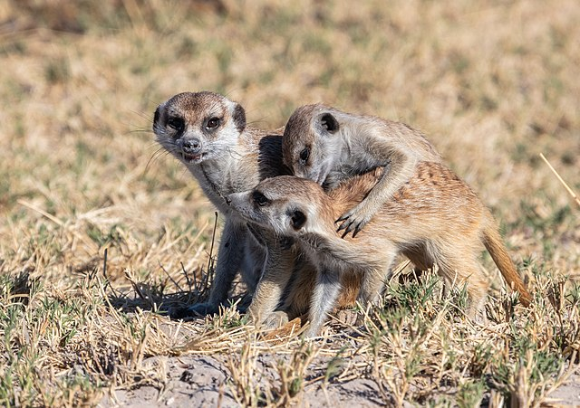

## Merkmale

Erdmännchen sind nach den Zwergmangusten die kleinsten Mangusten. Sie erreichen eine Kopfrumpflänge von 24,5 bis 29 cm, der Schwanz misst 19 bis 24 cm. Sie wiegen zwischen 620 und 970 g,[1] mit durchschnittlich 731 g sind Männchen geringfügig schwerer als Weibchen, die durchschnittlich 720 g erreichen.[2] Ihr Körperbau ist schlank und langgestreckt, die Beine sind kurz. Die kräftigen Vorderbeine enden in vier Zehen, die mit scharfen und rund 15 mm langen Krallen versehen sind. Die Hinterpfoten tragen ebenfalls vier Zehen, die Krallen sind mit 8 mm aber deutlich kürzer.

Das Fell ist weich und eng am Körper anliegend, seine Färbung variiert von hellbraun bis graubraun, die nur spärlich behaarte Unterseite ist heller. Die Tiere im Süden des Verbreitungsgebietes sind generell dunkler als die Tiere im Norden. Am Rücken verlaufen dunkle, manchmal verwaschene Querstreifen. Die Augen sind von dunklen Flecken umgeben, auch die Ohren sind schwarz. Die Länge der Deckhaare an der Schulter beträgt rund 15 mm, am Rumpf werden sie etwa 30 bis 40 mm lang. Der schlanke Schwanz ist zugespitzt und nicht buschig, er ist gelblichbraun und endet in einer schwarzen Spitze.

Der Schädel ist hoch und rundlich, charakteristisch sind die großen Augenhöhlen, die mehr als 20 % der Schädellänge ausmachen. Die Schnauze ist relativ groß und zugespitzt. Die Ohren sind klein und halbmondförmig, sie können geschlossen werden, damit beim Graben kein Sand eindringen kann. Die Zahnformel lautet I 3/3 – C 1/1 - P 3/3 - M 2/2, insgesamt haben sie also 36 Zähne. Die äußeren oberen Schneidezähne sind größer als die übrigen Schneidezähne, die oberen Eckzähne sind gerade, die unteren gebogen. Die Backenzähne zeigen Anpassungen an die Insektennahrung: Die Molaren sind breit und haben spitze Höcker, die bei allen Landraubtieren vorhandene Brechschere ist nur schwach ausgeprägt.
